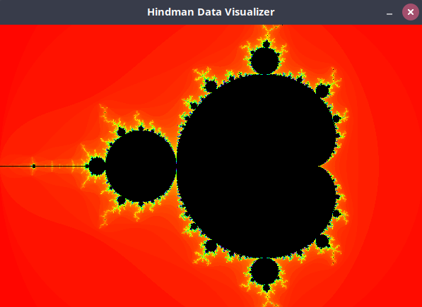
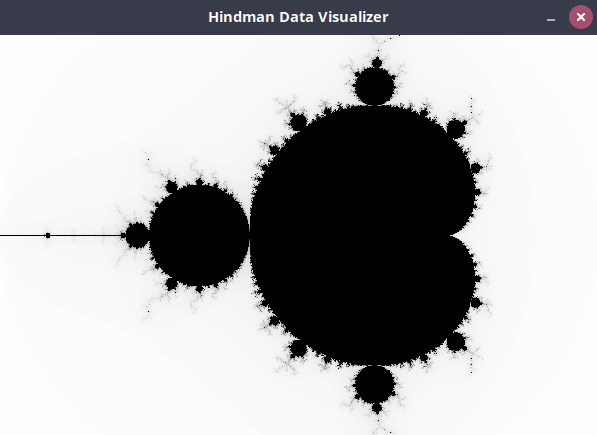

# Module 7 Lab Guide (part 2)

## Lab Activity 2 - Mandelbrot
First some background on the Mandelbrot set, please watch [Mandelbrot Sets Back to Basics by Numberphile](https://youtu.be/FFftmWSzgmk) before proceeding with this Lab.

### Problem Description
Generating a Mandelbrot set is a classic Computer Science and Mathematics exercise that we are going to use to demonstrate arrays.  In this activity you will write an application that generates a Mandelbrot set in a two dimensional array of integer values. Each location within the two dimensional array represents a pixel on the display panel with the value at index [0][0] representing the upper left corner of the panel and index [numRows - 1] [numCols - 1] representing the pixel in the lower right corner of the panel. The value stored at each index represents the number of iterations of the Mandelbrot equation before that cell "fell" out of the set. 

Having a two dimensional array of integer values, is great, but not very useful.  In order to visualize this Mandelbrot set, you will need to provide a color palette that will map a given number of iterations to a Color. To do this you will write a function that will generate an array of Color objects where the objects stored at index [0] will be the Color to use for 0 iterations, index [1] will be the Color to use for 1 iterations, and so on up to index [MAX_ITERATIONS -1] which will be the Color black. The image below shows the Mandelbrot set we will be generating in this activity.



You will use the provided Visualizer class to display your Mandelbrot set on the screen. In Module 8 you will learn about all the GUI components used in this class, but for now you can simply use it.  In order to use it, you will need to provide a class that implements the HindmanVisualizer interface. The **DataVisualizerDemo** program in the [Module 7 Guided Experimentation Activity](https://github.com/lhindman/cs121-mod07-examples) demonstrates a class that implements the HindmanVisualizer interfaces and uses the Visualizer class to display a two dimensional dataset.

### Program Design
Please open Mandelbrot.java.  You'll find that the **Mandelbrot** class header already implements the HindmanVisualizer and that the methods required by the interface are already stubbed out. We'll come back to these later.  You'll also notice that the *main()* method has already been implemented to create both a new Mandelbrot() object and a Visualizer() object. We should not need to make any changes to the *main()* method for this activity.

#### Instance Variables (and constants)
The Mandelbrot Set simulation requires a number of fixed values in order to render properly. We will define this values at the top of the **Mandelbrot** class as constants. The standard implementation of the Mandelbrot Set utilized complex numbers with both *REAL* and *IMAGINARY* components. Java does not natively include support for complex data types, so our implementation will treat these as separate values as shown below.
```
private final int DISPLAY_WIDTH = 600;
private final int DISPLAY_HEIGHT = 400;
private final int MAX_ITERATIONS = 255;
private final double REAL_START = -2.0;
private final double REAL_END = 1;
private final double IMAGINARY_START = -1;
private final double IMAGINARY_END = 1;
```

In addition, we will require a two dimensional array of integer values to represent the simulation data and a single dimension array of Color objects to represent the color palette.

#### Constructor
The constructor will need to instantiate the two dimensional simulation data array using *DISPLAY_HEIGHT* for the number of rows and *DISPLAY_WIDTH* for the number of columns. The constructor will also need to instantiate the color palette array using MAX_ITERATIONS+1 for the number of elements.   

We're not done with the constructor yet, but we're done for now. :)


#### Interface Methods
Please carefully read the javadoc comments provided in HindmanVisualizer.java to be certain you understand the required functionity of each method then do the following
- Update the *getDataSet()* method to return a reference to the instance variable containing the two dimensional array of simulation data.
- Update the *getDimensions()* method to return a new **Dimension** object using the *DISPLAY_WIDTH* and *DISPLAY_HEIGHT* constants
- Make no changes to the *getColorPalette()* method, letting it continue to return null.  The Visualizer class will detect this null value and use a gray scale palette to visualize the data.

#### Private Helper Methods
Use the following pseudocode algorithm to generate the Mandelbrot set and store the values in the two dimensional simulation data array. It will be convent to implement this algorithm as two private helper methods with the following signatures
- private int mandelbrot(double x0, double y0) {...}
- private void generateMandelbrotSet() {...}  

**NOTE:** As you implement these functions, pay particular attention to the variable data types. They will be either *int* or *double* variables and should **NOT** require any casts aside from those specifically included in the algorithm.

```
function int mandelbrot( x0, y0):
        x = 0.0
        y = 0.0

        iteration = 0
        maxIteration = MAX_ITERATIONS

        while (x * x + y * y <= 2 * 2 AND iteration < maxIteration):
            xtemp = x * x - y * y + x0
            y = 2 * x * y + y0
            x = xtemp
            iteration = iteration + 1

        return iteration;
```

```
function void generateMandelbrotSet():

        numRows = DISPLAY_HEIGHT
        numCols = DISPLAY_WIDTH

        for (row = 0; row < numRows; row++):
            for (col = 0; col < numCols; col++):

                x0 = REAL_START + (col / (double)numCols) * (REAL_END - REAL_START)
                y0 = IMAGINARY_START + (row / (double)numRows)* (IMAGINARY_END - IMAGINARY_START)

                m = mandelbrot(x0, y0)
                simData[row][col] = m

```  

Once the methods have been implemented, call the *generateMandelbrotSet()* method from the constructor, then run the program. If the mandelbrot functions are implemented correctly, they should generate a gray scale image of the Mandelbrot set exactly as showing in the following image.



### STOP STOP STOP
At this point, commit and push your code then take a break. You've earned it!

### Color Palette
Entire books have been written on how to select color palettes to best show off the features of Mandelbrot Sets. In addition, there are many different ways to represent Color. Java Color objects defined using the [RGB color model](https://en.wikipedia.org/wiki/RGB_color_model)where the red, green and blue values are specified using integer values in the range of 0 - 255.  

Java also supports Color objects defined using the [HSB color model](https://en.wikipedia.org/wiki/HSL_and_HSV) where the color is specified as Hue, Saturation and Brightness. Each of these values is specified as a floating point value in the range of 0 to 1. The *Color.getHSBColor(float hue, float saturation, float brightness)* returns a Color object based upon the specified values. 

#### Interface Methods
Please carefully read the javadoc comments provided in HindmanVisualizer.java to be certain you understand the required functionity of each method then do the following
- Update the *getColorPalette()* method to return a reference to the instance variable containing the color palette. The visualize will now use this data instead of the gray scale palette to visualize the Mandelbrot set.

#### Private Helper Methods
Use the following pseudocode algorithm to generate the color palette and store the values in the single dimensional color palette array. It will be convent to implement this algorithm as a private helper method with the following signature
- private void generateColorPalette() {...}

```
function void generateColorPalette():
        for (int x = 0; x < palette.length; x++):
            hue = 255 * (x / (float) MAX_ITERATIONS)
            saturation = 255
            brightness = 255

            palette[x] = Color.getHSBColor(hue/255f, saturation/255f, brightness/255f)

        palette[MAX_ITERATIONS] = Color.BLACK
```
Once the method has been implemented, call the *generateColorPalette()* method from the constructor, then run the program. If the mandelbrot functions are implemented correctly, they should generate a color image of the Mandelbrot set exactly as shown below


### Implementation Guide
1. Expand the folder named Mandelbrot and open the file named Mandelbrot.java
2. Design a program to satisfy the requirements in the Problem Description and the Program Design above
3. Test the program and pay particular attention to boundary/edge cases and invalid input.
4. Commit the changes to your local repository with a message stating that Activity 1 is completed.
5. Push the changes from your local repository to the github classroom repository.


## Coding Journal (Optional)
Keep a journal of your activities as you work on this lab. Many of the best engineers that I have worked with professionally have kept some sort of engineering journal. I personally packed notebooks around with me for nearly 8 years before I began keeping my notes electronically.   

Your journal can track ideas, bugs, cool links, code snippets, shell commands, rants, or simply a reflection on what worked well or not-so-well with this lab activity. I will not be grading the content of your journal, but I will expect at least two timestamped journal entries of at least a 75 to 150 words each added to the provided Journal.md file.  The purpose of this component is to help develop the habit of taking notes and creating documentation while you code. The more detail you provide the better as that will help you if you ever need to refer back to this project in the future.

## Markdown Resources
Markdown is a notation that is used to format text documents.  It is widely used in Software Development shops around the world, which is why we're asking you to use it in your lab documentation.  

Github provides a guide for getting started:  [Mastering Markdown](https://guides.github.com/features/mastering-markdown/)

